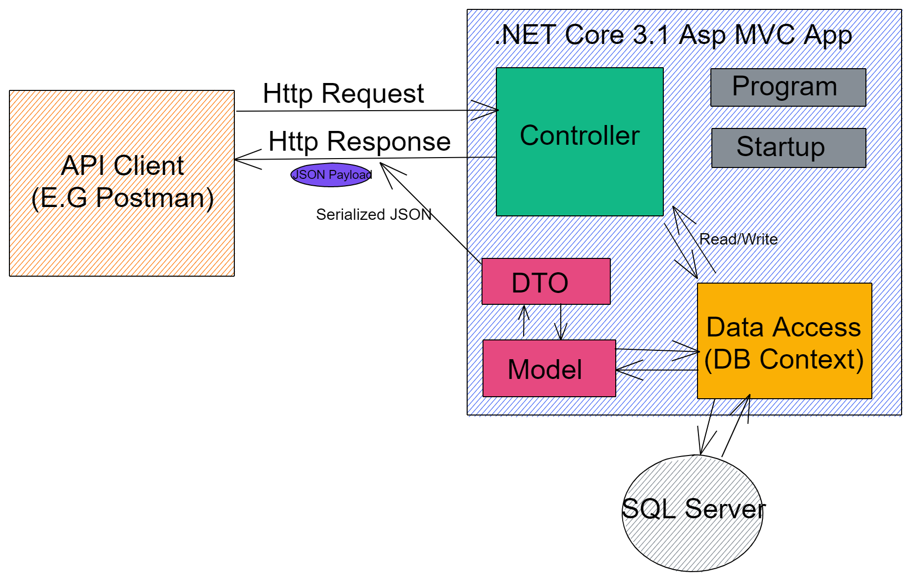



# Bookstore API

A small demo project written with **.Net Core 3.1 Web Api** template.  All models were scaffolded by **Entity Framework** via a "database first" approach. The project is mainly derived from [Les Jackson's The Complete ASP.NET CORE 3 API Tutorial ](https://www.amazon.com/Complete-ASP-NET-Core-Tutorial-Hands/dp/1484262549)

## Important Dependencies

 1. **Entity Framework** - Mediator between the database and controllers.  Generates models from the database
 2. **Swashbuckle/Swagger** - API documentation
 3. **FluentValidation** - Validation tool for data transfer objects
 4. **AutoMapper** - Maps models to dtos and vice versa
 

Check dependencies/packages for complete list

## Not Explored

Below is a list of topics not explored by this demo

 - Testing 
 - Environment Variables and User Secrets
 - Authentication and Authorization
 - Continuous Integration
 - Docker
